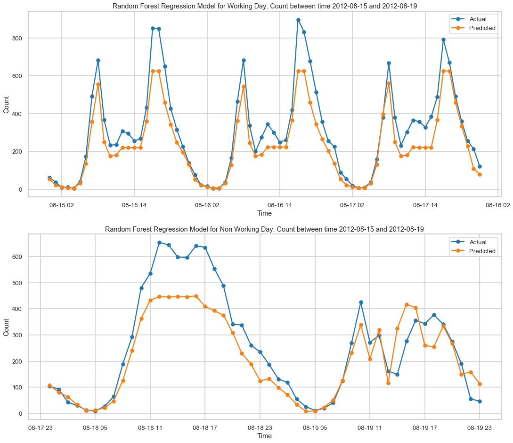

# Bike-Sharing-Demand-Prediction
In this project, we train a model to predict the number of bike rentals at any hour of the year given the weather conditions. The data set was obtained from the Capital Bikeshare program in Washington, D.C. which contained the historical bike usage pattern with weather data spanning two years.

We first build several individual regression models such as Linear, Ridge, Random Forest, Gradient Boost and Adaboost. We then use 'Stacking' approach where the predictions from these level 1 individual models are used as meta-features to build a second level model (Linear Regressor, Random Forest and Gradient Boost) to further enhance the predicting capabilities.

The key takeaway from the EDA and Modeling are 
* Bike rental count is strongly correlated with the time of the day, with weaker dependence on the temperature and humidity 
* There are 2 rental patterns across the day in bike rentals count
	* First on a Working Day where the rental count high at peak office hours (8am and 5pm) and 
	* Second on a Non-working day where rental count is more or less uniform across the day with a peak at around noon.

Below figure shows the bike rental behavior and our model predictions on the test set data for a Random Forest Model 

